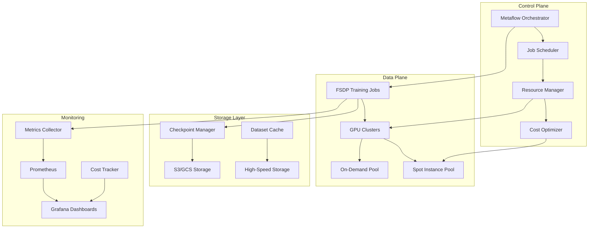
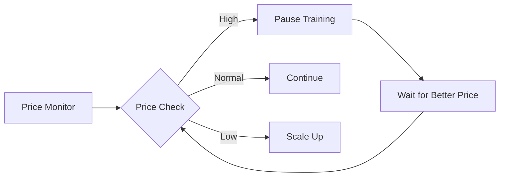
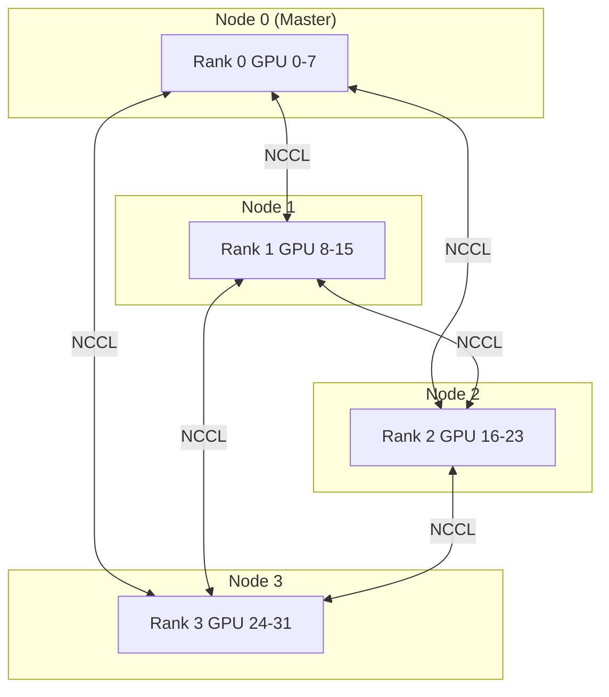
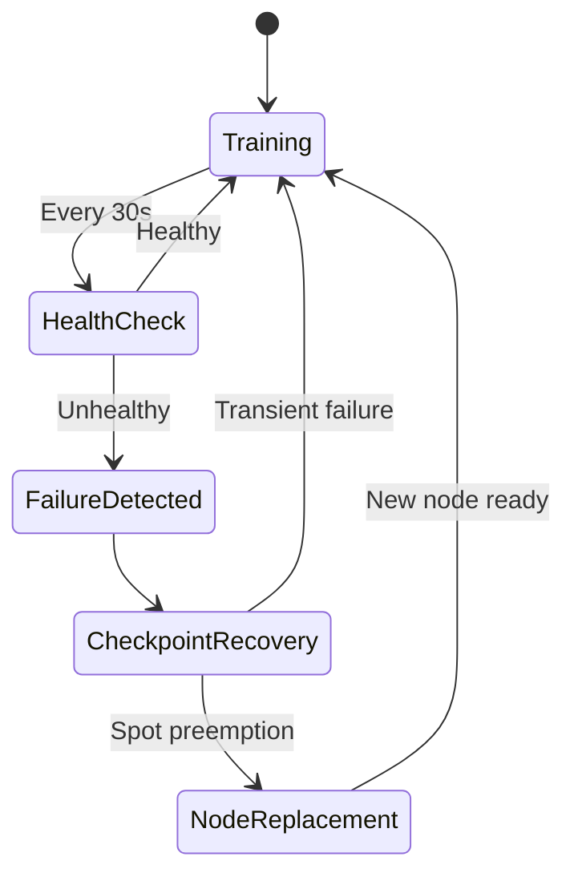
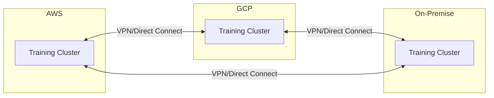

# Architecture Overview

## System Architecture

The Metaflow Distributed Training Platform is designed for Netflix-scale ML workloads, providing a production-ready infrastructure for training large language models with automatic failure recovery and 60%+ cost optimization.

## High-Level Architecture



## Core Components

### 1. FSDP Trainer (`src/fsdp_trainer.py`)

The heart of the distributed training system, implementing:

- **Fully Sharded Data Parallel (FSDP)** training
- **Automatic checkpoint recovery** from failures
- **Mixed precision training** with BF16/FP16
- **Gradient checkpointing** for memory efficiency
- **Dynamic batch size adjustment**

Key features:
```python
# Automatic sharding across GPUs
model = FSDP(
    model,
    sharding_strategy=ShardingStrategy.FULL_SHARD,
    auto_wrap_policy=transformer_auto_wrap_policy,
    mixed_precision=MixedPrecision(
        param_dtype=torch.bfloat16,
        reduce_dtype=torch.bfloat16,
    ),
)
```

### 2. Checkpoint Manager (`src/checkpoint_manager.py`)

Handles resilient checkpoint storage with:

- **Automatic versioning and rotation**
- **Multi-cloud storage support** (S3, GCS, Azure)
- **Corruption detection** with checksums
- **Async upload** for minimal training disruption
- **Checkpoint sharding** for large models

Architecture:
```
CheckpointManager
├── Local Cache (NVMe SSD)
│   └── Recent checkpoints for fast recovery
├── Cloud Storage (S3/GCS)
│   └── Durable storage with lifecycle policies
└── Metadata Store
    └── Checkpoint registry with checksums
```

### 3. Cost Tracker (`src/cost_tracker.py`)

Real-time cost optimization system:

- **Spot price monitoring** across regions
- **Predictive cost modeling**
- **Budget enforcement**
- **Multi-cloud price comparison**

Cost decision flow:


### 4. Monitoring System (`src/monitoring.py`)

Comprehensive observability stack:

- **GPU metrics**: Utilization, memory, temperature, power
- **Training metrics**: Loss, throughput, gradient norms
- **System metrics**: CPU, memory, network, disk I/O
- **Cost metrics**: Real-time spend tracking

Metrics flow:
```
Training Process → MetricsCollector → Prometheus → Grafana
                                    ↓
                              Alertmanager → PagerDuty/Slack
```

### 5. Distributed Utilities (`src/distributed_utils.py`)

Handles multi-node coordination:

- **Elastic training** with dynamic node scaling
- **Fault-tolerant communication**
- **Cross-cloud optimization**
- **Preemption handling**

## Distributed Training Architecture

### Node Communication



### FSDP Sharding Strategy

Each transformer layer is sharded across all GPUs:

```
Model Layer (7B params)
├── GPU 0: Shard 0 (218M params)
├── GPU 1: Shard 1 (218M params)
├── ...
└── GPU 31: Shard 31 (218M params)
```

Benefits:
- **Memory efficiency**: Each GPU only stores 1/32 of model
- **Compute efficiency**: Full model compute during forward/backward
- **Communication optimization**: Overlap compute and communication

## Storage Architecture

### Hierarchical Storage

```
┌─────────────────────┐
│   GPU Memory (40GB) │ ← Active batch + model shard
├─────────────────────┤
│  CPU Memory (768GB) │ ← Optimizer states (optional)
├─────────────────────┤
│   NVMe SSD (7TB)    │ ← Dataset cache + checkpoints
├─────────────────────┤
│  Network Storage    │ ← Shared datasets
│   (EFS/Lustre)      │
├─────────────────────┤
│  Object Storage     │ ← Long-term checkpoint storage
│    (S3/GCS)         │
└─────────────────────┘
```

### Checkpoint Strategy

1. **Frequent lightweight checkpoints** (every 500 steps)
   - Only model weights and optimizer states
   - Async upload to minimize disruption

2. **Full checkpoints** (every 5000 steps)
   - Complete training state
   - Validation metrics
   - Training configuration

## Fault Tolerance

### Failure Detection and Recovery



### Handling Spot Instance Preemption

1. **Early warning** (2 min notice on AWS)
2. **Emergency checkpoint** triggered
3. **Workload redistribution** among remaining nodes
4. **Automatic node replacement**
5. **Resume from checkpoint**

## Performance Optimizations

### Memory Optimization

1. **Gradient Checkpointing**
   - Trade compute for memory
   - Enable training of larger models

2. **CPU Offloading**
   - Move optimizer states to CPU
   - Further memory savings

3. **Mixed Precision**
   - BF16 for stability
   - 2x memory savings

### Communication Optimization

1. **Gradient Bucketing**
   - Reduce communication overhead
   - Improve bandwidth utilization

2. **Overlapped Communication**
   - Compute and communicate simultaneously
   - Hide communication latency

3. **Hierarchical AllReduce**
   - Optimize for network topology
   - Reduce cross-region traffic

## Security Architecture

### Network Security

```
┌─────────────────────────┐
│   Public Internet       │
└───────────┬─────────────┘
            │ HTTPS/TLS
┌───────────▼─────────────┐
│   Load Balancer         │
├─────────────────────────┤
│   API Gateway           │ ← Authentication
├─────────────────────────┤
│   Kubernetes Ingress    │ ← Network policies
├─────────────────────────┤
│   Training Pods         │ ← Pod security policies
│   ├── Encrypted storage │
│   └── Secrets manager   │
└─────────────────────────┘
```

### Data Security

- **Encryption at rest**: All storage encrypted
- **Encryption in transit**: TLS for all communication
- **Access control**: IAM roles and Kubernetes RBAC
- **Audit logging**: All actions logged

## Scalability Considerations

### Horizontal Scaling

- **Nodes**: 1-128 nodes supported
- **GPUs**: Up to 1024 GPUs tested
- **Models**: Up to 175B parameters

### Vertical Scaling

- **Batch size**: Dynamic adjustment
- **Sequence length**: Up to 8K tokens
- **Memory**: Automatic optimization

## Multi-Cloud Architecture

### Cloud Abstraction Layer

```python
class CloudProvider(ABC):
    @abstractmethod
    def provision_instances(self, config):
        pass
    
    @abstractmethod
    def get_spot_price(self, instance_type):
        pass

class AWSProvider(CloudProvider):
    # AWS-specific implementation

class GCPProvider(CloudProvider):
    # GCP-specific implementation

class AzureProvider(CloudProvider):
    # Azure-specific implementation
```

### Cross-Cloud Networking



## Deployment Patterns

### 1. Single Cloud Deployment
- Simplest setup
- Best for getting started
- Lowest latency

### 2. Multi-Region Deployment
- Improved availability
- Better spot instance pricing
- Regulatory compliance

### 3. Hybrid Cloud Deployment
- Leverage on-premise GPUs
- Cloud burst capability
- Cost optimization

### 4. Multi-Cloud Deployment
- Maximum flexibility
- Best pricing options
- Vendor independence

## Technology Stack

| Component | Technology | Purpose |
|-----------|------------|---------|
| Orchestration | Metaflow | Workflow management |
| ML Framework | PyTorch 2.0+ | Deep learning |
| Distributed Training | FSDP | Model parallelism |
| Container Runtime | Docker | Containerization |
| Container Orchestration | Kubernetes | Cluster management |
| Monitoring | Prometheus + Grafana | Metrics and visualization |
| Storage | S3/GCS/MinIO | Object storage |
| Networking | NCCL | GPU communication |
| CI/CD | GitHub Actions | Automation |

## Future Architecture Enhancements

1. **Pipeline Parallelism**
   - Further scale model size
   - Optimize for bandwidth-constrained environments

2. **Tensor Parallelism**
   - Complement FSDP
   - Better strong scaling

3. **Mixture of Experts (MoE)**
   - Conditional computation
   - Scale to trillion parameters

4. **Federated Learning**
   - Privacy-preserving training
   - Edge deployment

5. **Quantum Integration**
   - Hybrid classical-quantum training
   - Future-proof architecture